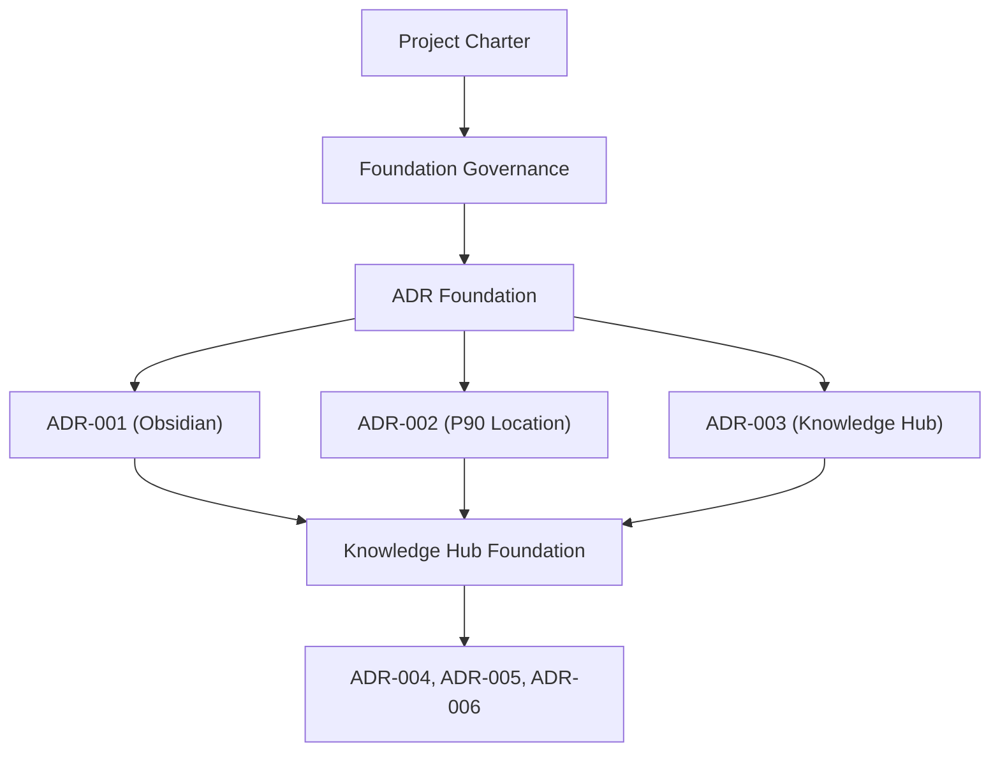

# Architecture Roadmap

## 1. Účel

Tento dokument slouží jako centrální rozcestník a navigační mapa pro architekturu projektu **AUTEL AI Project Manager – PILOT**. Popisuje jednotlivé architektonické oblasti, jejich aktuální stav implementace, vzájemné závislosti a vazby na schválená architektonická rozhodnutí (ADR). Pomáhá Product Ownerovi prioritizovat další kroky rozvoje projektu bez zacházení do nízkoúrovňových detailů implementace.

---

## 2. Principy

Při rozvoji architektury a plánování dalších fází se důsledně řídíme následujícími principy:
- **Kaizen:** Architektura se vyvíjí postupně po malých, stabilních a plně funkčních krocích.
- **Architecture First:** Návrh struktury, pravidel a logických vazeb předchází samotné fyzické tvorbě nebo konfiguraci.
- **ADR Driven:** Každé zásadní technické a architektonické rozhodnutí musí být nejprve zdokumentováno a schváleno formou ADR.
- **Documentation Before Implementation:** Nejprve vzniká koncepční dokumentace a standardy, až poté následuje samotná implementace v prostředí.

---

## 3. Stav fáze Foundation

Níže uvedená tabulka zobrazuje aktuální pokrok v budování základů (Foundation) projektu:

| Oblast / Dokument | Stav | Související dokumenty |
| :--- | :--- | :--- |
| **Project Charter** | `Completed` | [[00 Administration/Project Charter|Project Charter]] |
| **Foundation Governance** | `Completed` | [[00 Administration/PROJECT_CONTEXT|PROJECT_CONTEXT]], [[00 Administration/CHATGPT_ROLE|CHATGPT_ROLE]] |
| **ADR Foundation** | `Completed` | [[docs/adr/README|ADR Úvod]], [[docs/adr/ADR-TEMPLATE|ADR Šablona]], [[docs/adr/ADR-INDEX|ADR Index]] |
| **ADR-001** | `Completed` | [[docs/adr/decisions/ADR-001-obsidian-primary-knowledge-workspace|ADR-001 Obsidian Primary Workspace]] |
| **ADR-002** | `Completed` | [[docs/adr/decisions/ADR-002-project-brain-location|ADR-002 Project Brain Location]] |
| **ADR-003** | `Completed` | [[docs/adr/decisions/ADR-003-autel-knowledge-hub-location|ADR-003 AUTEL Knowledge Hub Location]] |

---

## 4. Plánované oblasti Foundation

Tyto oblasti představují další kroky v budování základního architektonického rámce:

| Oblast / Téma | Stav | Popis |
| :--- | :--- | :--- |
| **Documentation Standards** | `Completed` | Kanonická pravidla pro metadata Markdown dokumentů a konzistenci dokumentace. |
| **Knowledge Hub Foundation** | `In Progress` | Architektonický a metodický základ celofiremního úložiště znalostí. |
| **PARA Organization** | `Planned` | Logické rozdělení a organizace složek podle upravené metodiky PARA pro projekty AUTEL. |
| **Expert Domains** | `Planned` | Specifikace a pravidla pro znalostní báze jednotlivých odborných oddělení. |
| **AI Playbooks** | `Planned` | Standardizace pracovních postupů pro AI a instrukcí pro Copiloty. |
| **Decision Brain** | `Planned` | Návrh mechanismu pro zaznamenávání a analýzu klíčových rozhodnutí v projektech. |
| **Project Brain Specification** | `Planned` | Detailní technická specifikace a šablona pro Project Brain v projektech AUTEL. |

---

## 5. Závislosti

Grafické a textové znázornění závislostí a postupu implementace jednotlivých architektonických milníků:

### Textový řetězec závislostí:
1. **[[00 Administration/Project Charter|Project Charter]]** (Základní shoda na cílech a vymezení projektu)
   * ↓
2. **Foundation Governance** (Definice kontextu a rolí spolupráce)
   * ↓
3. **ADR Foundation** (Zavedení procesu zaznamenávání rozhodnutí)
   * ↓
4. **[[docs/adr/decisions/ADR-001-obsidian-primary-knowledge-workspace|ADR-001]]**, **[[docs/adr/decisions/ADR-002-project-brain-location|ADR-002]]**, **[[docs/adr/decisions/ADR-003-autel-knowledge-hub-location|ADR-003]]** (Klíčová úvodní rozhodnutí)
   * ↓
5. **Knowledge Hub Foundation** (Metodický rámec pro celofiremní znalosti)
   * ↓
6. **ADR-004, ADR-005, ADR-006** (Rozhodnutí navazující na detailní technickou implementaci)

---

## 6. Pravidla

Při práci s tímto roadmapem a architekturou platí následující závazná pravidla:
- **Zápis nových oblastí:** Každá nová koncepční oblast fáze Foundation se musí nejprve objevit v tomto roadmapu jako `Planned`, než na ní začnou práce.
- **Role ADR:** Záznamy ADR slouží výhradně k dokumentování zásadních architektonických a technologických rozhodnutí (nikoli k detailním návodům).
- **Role realizačních dokumentů:** Konkrétní implementační detaily a postupy jsou popsány ve standardních metodikách a realizačních dokumentech, nikoli v ADR.
- **Rozhodovací autorita:** O prioritách, změnách stavu a schvalování architektonických kroků rozhoduje výhradně Product Owner.
